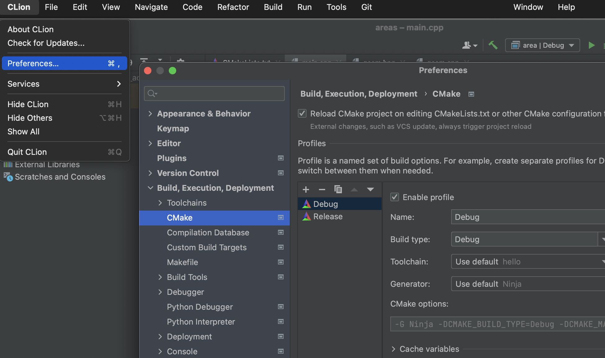

## Materiales adicionales para Arquitectura de Computadores

<html>
<ul>
<li> License <a href="http:/creativecommons.org/licenses/by-nc/4.0/">CC BY-NC 4.0</a> </li>
<li> Curso 2022-2023</li>
</ul>
</html>


## Transparencias y esquemas

<html>
  <small>
  <table>
   <thead>
     <tr><th>Sesión</th><th>Tema</th><th>Esquemas</th></tr>
   </thead>
   <tbody>
   <tr>
    <td>02</td><td>Fiabilidad</td>
    <td><ul type="1">
     <li> <a href="https://acaldero.github.io/uc3m_ac/esquemas/gii-ac-fiabilidad-v3.pdf">gii-ac-fiabilidad-v3.pdf</a></li>
    </ul></td>
   </tr> 
   <tr>
    <td>02</td><td>Fiabilidad (RAID)</td>
    <td><ul type="1">
     <li> <a href="https://acaldero.github.io/uc3m_ac/esquemas/gii-ac-fiabilidad-raid-v3.pdf">gii-ac-fiabilidad-raid-v3.pdf</a></li>
    </ul></td>
   </tr> 
   <tr>
    <td>08</td><td>OpenMP</td>
    <td><ul type="1">
     <li> <a href="https://acaldero.github.io/uc3m_ac/esquemas/gii-ac-omp-v3.pdf">gii-ac-omp-v3.pdf</a></li>
    </ul></td>
   </tr> 
   <tr>
    <td>10</td><td>Coherencia (directorio)</td>
    <td><ul type="1">
     <li> <a href="https://acaldero.github.io/uc3m_ac/esquemas/gii-ac-coherencia-directorio-v2.pdf">gii-ac-coherencia-directorio-v2.pdf</a></li>
    </ul></td>
   </tr> 
   <tr>
    <td>12</td><td>Modelos de consistencia</td>
    <td><ul type="1">
     <li> <a href="https://acaldero.github.io/uc3m_ac/esquemas/gii-ac-modelos_consistencia-v3.pdf">gii-ac-modelos_consistencia-v3.pdf</a></li>
    </ul></td>
   </tr> 
   <tr>
    <td>13</td><td>At&oacute;micos y consistencia de memoria con C++</td>
    <td><ul type="1">
     <li> <a href="https://acaldero.github.io/uc3m_ac/esquemas/gii-ac-consistencia_en_cpp-v3.pdf">gii-ac-consistencia_en_cpp-v3.pdf</a></li>
    </ul></td>
   </tr> 
   <tr>
    <td>14</td><td>Sincronizaci&oacute;n</td>
    <td><ul type="1">
     <li> <a href="https://acaldero.github.io/uc3m_ac/esquemas/gii-ac-modelos_sincronizacion-v3.pdf">gii-ac-modelos_sincronizacion-v3.pdf</a></li>
    </ul></td>
   </tr> 
   <tbody>
  </table>
  </small> 
</html>


## Laboratorios con sistema de colas

* Hay ciertos casos en los que varios usuarios+as han de ejecutar sus programas de forma que los ordenadores que usen (llamados nodos) se asignen en exclusividad para esa persona (en un mismo nodo no se ejecuten los trabajos de dos o más usuarios+as a la vez).
* Uno de estos casos es la medición de rendimiento de manera que cuando se ejecuta un programa de medición no se quiere tener interferencias de la ejecución de otro programa de medición a la vez.
* Para estos casos se usa un sistema de trabajos en cola, que se encarga de asignar nodos durante un tiempo limitado a las personas que lo usen para que puedan trabajar en exclusividad si lo precisan.

### 1. Pre-requisitos

Ha de disponer de:
1. Cuenta en el Laboratorio del Departamento de Informática:
   * Para solicitar la apertura de cuenta siga los pasos indicados en:
     * https://www.lab.inf.uc3m.es/servicios/apertura-de-cuenta/
1. El software MobaXterm (o similar):
   * El Laboratorio del Departamento de Informática dispone de un manual muy recomendable en:
     * https://www.lab.inf.uc3m.es/wp-content/docs/Manual_ConexionSSH.pdf

### 2. Lanzar un trabajo en la cola
  a. Compruebe primero que está conectado a avignon.lab.inf.uc3m.es (que es el nodo front-end o nodo de cabecera)
  
  b. Ha de crear un script con todo lo que quiera ejecutar en ese trabajo encolado. Por ejemplo, el script do-lscpu.sh tendrá el siguiente contenido:
```
#!/bin/sh
set -x
ls -las
```

  c. A continuación ha de usar sbatch para pedir ejecutar el script como trabajo en cola:
```
sbatch do-ls.sh
``` 

  d. Puede que tarde en ejecutarse, para ver el estado en la cola puede ejecutar:
```
squeue
```
Y la salida será:
```
   JOBID PARTITION     NAME     USER ST       TIME  NODES NODELIST(REASON)
     555       all    do-ls acaldero  R       0:02      1 c54
```
Si no encuentra su trabajo en la lista es que posiblemente haya finalizado ya su ejecución.

  e. Tras su ejecución se genera un archivo slurm-XXX.out (siendo XXX un número que identifica a la petición de ejecución, es decir, el JOBID) por lo que el resultado de su ejecución se puede ver con:
```
cat slurm-XXX.out
```

  x. Si por cualquier razón el trabajo entra en un bucle infinito y no termina, tenemos la posibilidad de cancelarlo con scancel y el identificador de trabajo (JOBID):
```
scancel 555
```

### 3 Pedir un trabajo interactivo
  a. Compruebe primero que está conectado a avignon.lab.inf.uc3m.es (que es el nodo front-end o nodo de cabecera)
  
  b. Ha de solicitar una sesión interactiva (es útil para depurar o trabajos cortos interactivos):
```
srun --pty /bin/bash
```

  c. A continuación puede ejecutar los mandatos interactivos que precise:
```
ls -las
```

  d. Por último ha de finalizar la sesión interactiva:
```
exit
```

### 4 Selección de software específico a usar en el trabajo
  Es posible que haya disponible distintas implementaciones de un software instaladas, y varias versiones de cada implementación.
  Por ejemplo, si hay disponible distintos compiladores de C (gcc, clang, etc.) y varias versiones de alguno de ellos (gcc 10, gcc 12, etc.).<br/>
  Para poder seleccionar qué software y qué versión queremos usar para un trabajo particular de entre los disponibles se utiliza el programa **module**.

  a. Compruebe primero que software está disponible en avignon.lab.inf.uc3m.es (que es el nodo front-end o nodo de cabecera) o en el nodo interactivo con **module available**:
```
module avail
```
Y la salida podría ser:
```
dot  gcc/12.1.0  module-info  modules
```

  b. De la lista de software disponible, si queremos usar por ejemplo **gcc/12.1.0** hay que usar la opción **load**:
```
module load gcc/12.1.0
```

  c. Para listar el software ya cargado hay que usar la opción **list**:
```
module list
```
Y la salida podría ser:
```
Currently Loaded Modulefiles:
 1) gcc/12.1.0
```

  d. Para dejar de usar un software concreto que previamente se había cargado hay que usar la opción **unload**:
```
module unload gcc/12.1.0
```

  e. El siguiente ejemplo muestra cómo es posible añadir el uso de **module** a los trabajos en la cola:
```
#!/bin/sh

# Actualizar variables de entorno definidas en /etc/profile
.  /etc/profile

# Cargar gcc/12.1.0
module load gcc/12.1.0

# Compilar con cmake las reglas definidas en CMakeLists.txt
cmake -S . -B build -DCMAKE_BUILD_TYPE=Release
cmake --build build
```


## Laboratorios con Linux en portátil

### 1. Pre-requisitos

Ha de disponer el siguiente software:
1. Sistema operativo: Linux (Ubuntu, Debian, etc.)
2. Compilador: g++ versión 10 o superior
3. Construcción de proyecto: CMake
4. Entorno de desarrollo integrado: CLion

#### 1.1. Distribución Linux/Ubuntu

A Si se tiene Windows 10 (2004 o superior) se puede usar WSL2:
  * Para instalar WSL2 puede usar estos tutoriales:
    * https://ubuntu.com/tutorials/install-ubuntu-on-wsl2-on-windows-10#1-overview
    * https://medium.com/@japheth.yates/the-complete-wsl2-gui-setup-2582828f4577
  * Para usar una interfaz gráfica puede usar el siguiente tutorial:
    * https://aalonso.dev/blog/how-to-use-gui-apps-in-wsl2-forwarding-x-server-cdj
  * La carpeta descargas de Windows puede ser accedida desde el contenedor WSL2 usando:
```/mnt/c/Users/<usuario+a de windows>/Downloads```

B Si se tiene Windows 11 se puede usar WSL2:
  * Para instalar WSL2 puede usar este tutorial:
    * https://learn.microsoft.com/en-us/windows/wsl/tutorials/gui-apps
  * En Windows 11 la versión WSL2 permite usar aplicaciones gráficas sin software adicional.
  * La carpeta descargas de Windows puede ser accedida desde el contenedor WSL2 usando:
```/mnt/c/Users/<usuario+a de windows>/Downloads```

C Si tienes MacOS:
  * Es posible usar un contenedor docker instalando docker desktop:
    * https://www.techdevpillar.com/blog/how-to-run-ubuntu-on-mac-with-docker/
  * Dispone del siguiente projecto para facilitar el uso de un contenedor con Ubuntu:
    * https://github.com/acaldero/u20-docker

#### 1.2. Compilador g++ versión 10 o superior

Para instalar g++ versión 10 o superior dentro de Ubuntu ha de ejecutarse:
```
sudo apt-get update
sudo apt-get upgrade -y
sudo apt-get install build-essential libtool autoconf unzip wget -y
```

#### 1.3. CMake

Para instalar cmake dentro de Ubuntu ha de ejecutarse:
```
sudo apt-get update; sudo apt-get upgrade -y; sudo apt-get install cmake
```

#### 1.4. CLion

Para obtener CLion para Estudiantes ha de ir a la página Web:
* https://www.jetbrains.com/es-es/community/education/#students


### 2. Configuración de CLion

#### MacOS: CLion | Preferences



#### Windows: File | Settings


### 3. Sanitizer/Desinfectante

* Address Sanitizer y Leak Sanitizer
  * http://gavinchou.github.io/experience/summary/syntax/gcc-address-sanitizer/
* Thread Sanitizer
  * https://github.com/google/sanitizers/wiki/ThreadSanitizerCppManual
* Undefined Behavior Sanitizer
  * https://medium.com/@lucianoalmeida1/the-undefined-behavior-sanitizer-6e7fe78790c7
* Memory Sanitizer (clang++)
  * https://clang.llvm.org/docs/MemorySanitizer.html
